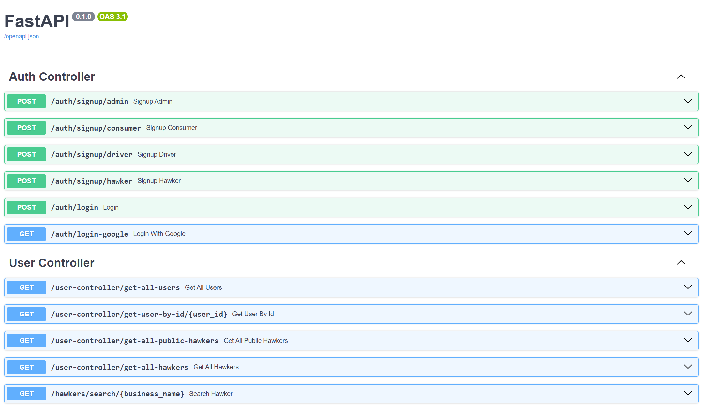

# FeedItForward 🍚

Welcome to the official repository for NTU SC2006 Software Engineering group project **_FeedItForward_**.

<p align='center'>
  
</p>

<p align="center">
    <a href="https://github.com/softwarelab3/2006-SCSX-FeedItForward/tree/main/FeedItForward/frontend">Frontend</a>
    |
    <a href="https://github.com/softwarelab3/2006-SCSX-FeedItForward/tree/main/FeedItForward/backend">Backend</a>
    |
    <a href="https://www.youtube.com/watch?v=yMwcUj8wCmo">Demo Video</a>
</p>

FeedItForward is a **community-driven initiative** that connects the surplus food from local hawkers directly to families in need. It not only reduces **food waste** but also ensures that **nutritious meals reach those most vulnerable** in our society.

This project applied **software engineering best practices** and **design patterns** to ensure high reliability, performance, and extensibility for future enhancements.

<details>
<summary>Demo Video</summary>
<br>

</details>

<br>

**Table of Content**

- [FeedItForward 🍚](#feeditforward-)
- [Setup Instructions](#setup-instructions)
  - [Frontend](#frontend)
  - [Backend](#backend)
    - [Database Seeding](#database-seeding)
- [Pre-configured Users](#pre-configured-users)
- [Documentation](#documentation)
- [API Docs](#api-docs)
  - [API Endpoints](#api-endpoints)
- [App Design](#app-design)
  - [Overview](#overview)
  - [Frontend](#frontend-1)
  - [Backend](#backend-1)
  - [Design Patterns](#design-patterns)
  - [SOLID Principles](#solid-principles)
  - [Tech Stack](#tech-stack)
- [External APIs](#external-apis)
- [Contributors](#contributors)

# Setup Instructions

## Frontend

1. In the `/frontend` directory, install the required node modules.

```bash
npm install
```

2. Start the application.

```bash
npm run start
```

And you are ready to start using the FeedItForward Frontend! The frontend application is running on http://localhost:3000/

## Backend

1. In the `/backend` directory, create a python virtual environment and activate it.

```bash
python -m venv .venv
. .venv/Scripts/activate # The .venv activation command might differ depending on your operating system
```

2. Install the required packages.

```bash
pip install -r requirements.txt
```

3. In the `/backend/app` directory, start the application.

```bash
cd app
uvicorn main:app --reload
```

And you are ready to start using the FeedItForward Backend! The server application is running on http://127.0.0.1:8000/

### Database Seeding

If you would like to seed the database with pre-configured data, please uncomment the following line in the `backend/app/main.py` before re-starting the application.

```python
# app/main.py
# Uncomment this line 👇🏻
# add_event_listener_to_seed_database()
```

_Note: Please ensure that the `sql_app.db` in the app directory is deleted before re-starting the application._

# Pre-configured Users

| Name                                     | Role     | Email               | Password  |
| ---------------------------------------- | -------- | ------------------- | --------- |
| Admin Jane                               | Admin    | admin1@gmail.com    | 123123123 |
| Janice                                   | Consumer | consumer1@gmail.com | 123123123 |
| Alicia                                   | Consumer | consumer2@gmail.com | 123123123 |
| James                                    | Consumer | consumer3@gmail.com | 123123123 |
| Alex (A Hot Hideout)                     | Hawker   | hawker1@gmail.com   | 123123123 |
| Adam (North Spine Koufu - Cai Fan Store) | Hawker   | hawker2@gmail.com   | 123123123 |
| Aaron (The Crowded Bowl)                 | Hawker   | hawker3@gmail.com   | 123123123 |
| Tim                                      | Driver   | driver1@gmail.com   | 123123123 |
| Thomas                                   | Driver   | driver2@gmail.com   | 123123123 |

# Documentation

# API Docs

The FeedItForward Backend application uses FastAPI, which comes with an in-built documentation for API routes created. You may access it via http://127.0.0.1:8000/docs#/

_\*Note: A total of **100 API routes** are documented._



## API Endpoints

The FeedItForward API Endpoints consists of 3 main category - `Controller`, `CRUD`, and `Misc`.

1. **`Controller`:** API endpoints for Controller specific functionalities as specified in the class diagrams designed.
2. **`CRUD`:** API endpoints for basic Create, Read, Update, and Delete Operation on classes saved in the database.
3. **`Misc`:** Other API endpoints such as file uploads and retrievals.

_Please refer to the the [API Docs page](#api-docs) for the specific endpoints and the required request body and expected response._

# App Design

## Overview


_Credits: [ztjhz](https://github.com/ztjhz)_

## Frontend

The frontend (React.js) mainly consists of the different **User Interfaces** (Screens), which are structured and categorized into **AdminUI**, **ConsumerUI**, **DriverUI**, **HawkerUI**, and **MainUI** as designed in the class diagrams. More detailed sub-screens can be found in the respective UI screen folders. They can be found in the `/src/screens` directory.

The `/src/App.tsx` is the entry point of the frontend application.

Other folders such as `/components`, `/contexts`, `/data`, `/utils`, `/schemas`, `/hooks`, and `/contexts` contains helper files that makes the frontend code more organized and easier to read for ease of collaboration (as recommended by the React.js framework).

## Backend

- `📁 app/assets`
  - Contains server assets like data files and uploads.
- `📁 app/models`
  - Contains the Business Objects.
- `📁 app/services`
  - Contains methods to create, read, update, and delete business objects.
- `📁 app/controllers`
  - Controllers that uses the various services implemented in the `app/services` directory.
  - They implements the Facade Pattern by masking the more complex underlying implementation details from the frontend.
- `📁 app/routers`
  - Routers that implements REST API endpoints for communication between frontend and backend. They allow the frontend to use the controllers in the backend.
  - Routers use the controllers implemented in the `app/controllers` directory.
- `📁 app/schemas`
  - Defines all the request and response fields.
- `📁 app/factory`
  - Factory design pattern implementation of the database.
- `📁 app/database.py`
  - Entry point to database that will store all the business objects.
- `📁 app/websocket.py`
  - Implements the Publisher-Subscriber Pattern via websockets for real-time text messaging communication between different users.

## Design Patterns

1. **`Strategy + Factory Patterns`** for Database Implementation.
   a. Refer to `backend/app/factory/database.py`
2. **`Facade Pattern`** via the Controllers.
   a. Refer to `backend/app/controllers/*.py`
3. **`Publisher-Subscriber Pattern`** for real-time text messaging communication between different users (websocket).
   a. Refer to `backend/app/websocket.py`

## SOLID Principles

1. **`Single Responsibility Principle (SRP)`**
   a. Different packages with different distinct responsibilities are created. Specific classes in each package are responsible for a specific business model or logic group.
2. **`Open-Closed Principle (OCP)`**
   a. The application is open to extension through the use of strategy pattern (database) as well as facade pattern (controllers).
3. **`Interface Segregation Principle (ISP)`**
   a. Numerous small and specific interfaces are used.
   b. For example, in `backend/app/schemas/consumer.py`, there are `Consumer`, `ConsumerCreate`, and `ConsumerUpdate` interfaces which are used for different purposes (Display, Creation, and Update).
4. **`Dependency Inversion Principle (DIP)`**
   a. High level and low level modules depends on abstractions through the use of the interfaces (`backend/app/schemas` and `frontend/src/schemas`).

## Tech Stack

**Frontend:**

- React.js
- TypeScript
- Tailwind CSS

**Backend:**

- FastAPI
- Python
- MySQL

# External APIs

1. **Singapore's OneMap API**
   1. Map (https://www.onemap.gov.sg/docs/maps/)
   2. Geocoding (https://developers.onemap.sg/commonapi/search?searchVal=639798&returnGeom=Y&getAddrDetails=Y)
2. **Weather API (Live)**
   1. 24-hour Weather Forecast (https://beta.data.gov.sg/datasets/d_50d2bbe678607d78d74a0fe6e8b5b6dd/view)
   2. 4-day Weather Forecast (https://beta.data.gov.sg/datasets/d_1efe4728b2dad26fd7729c5e4eff7802/view)
3. **Hawker GeoJson Dataset**
   1. https://beta.data.gov.sg/collections/1445/datasets/d_4a086da0a5553be1d89383cd90d07ecd/view
4. **Google OAuth 2.0 API**
   1. https://developers.google.com/identity/protocols/oauth2

# Contributors

The following contributors have contributed to the whole Software Developement Life-cycle, including (not exhausive):

1. Ideation and refinement
2. Generation of functional and non-funtional requirements
3. Generation of Use Cases and Descriptions
4. UI/UX Mockup and Prototyping (Figma)
5. Design of Architecture Diagram, Class Diagram, Sequence Diagrams, and Dialog Map Diagram
6. Development of Application
7. Black-box and White-box Testing
8. Documentations

| Name           | Github Username                               | Role       |
| -------------- | --------------------------------------------- | ---------- |
| Toh Jing Qiang | [xJQx](https://github.com/xJQx)               | Full-Stack |
| Toh Jing Hua   | [ztjhz](https://github.com/ztjhz)             | Backend    |
| Denise Tay     | [denisetay8](https://github.com/denisetay8)   | Frontend   |
| Minze          | [min-ze](https://github.com/min-ze)           | Frontend   |
| Tommy Wee      | [toomywee](https://github.com/toomywee)       | Frontend   |
| Pinyang        | [druggoat888](https://github.com/druggoat888) | Frontend   |
